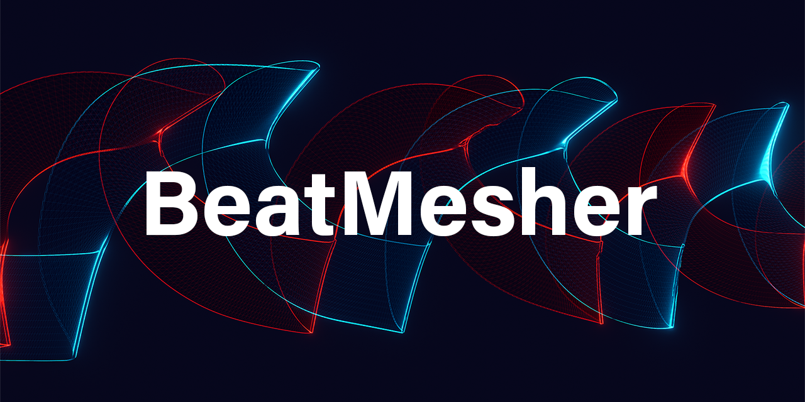
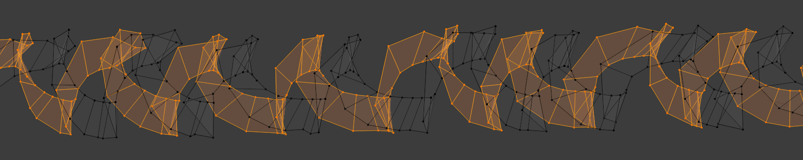
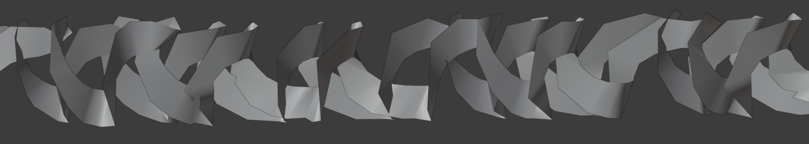
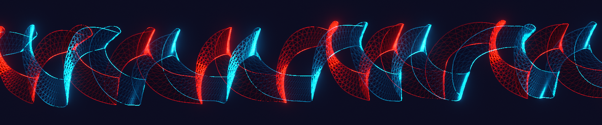

# BeatMesher

Capture Beat Saber plays as 3D models.

## Usage

After playing a song, an OBJ model will be written to
`<your Beat Saber directory>/BeatMesherCaptures`. This model contains two
"ribbons" constructed from the blade of each saber.

If you want to interpret replay data in some other way, BeatMesher writes a
CSV file next to the OBJ export. It has the following columns:

 - `time` - time (sec) at sample
 - `lbx,lby,lbz` - **l**eft blade **b**ottom **x/y/z**
 - `rbx,rby,rbz` - **r**ight blade **b**ottom **x/y/z**
 - `ltx,lty,ltz` - **l**eft blade **t**op **x/y/z**
 - `rtx,rty,rtz` - **r**ight blade **t**op **x/y/z**

See the [Examples](./Examples) directory for examples of both CSV and OBJ
outputs.

## Notes

BeatMesher does not match your gameplay exactly! By default, it samples saber
position every 3 frames. It also spaces out samples by a fixed 0.25 units when
constructing the final mesh. These values can be changed in the plugin config
(`UserData/BeatMesher.json`).

Finally, BeatMesher is still a prototype, and I would recommend uninstalling it
during serious gameplay. It will definitely cause Beat Saber to use more
memory, which I haven't measured the impact of yet.
